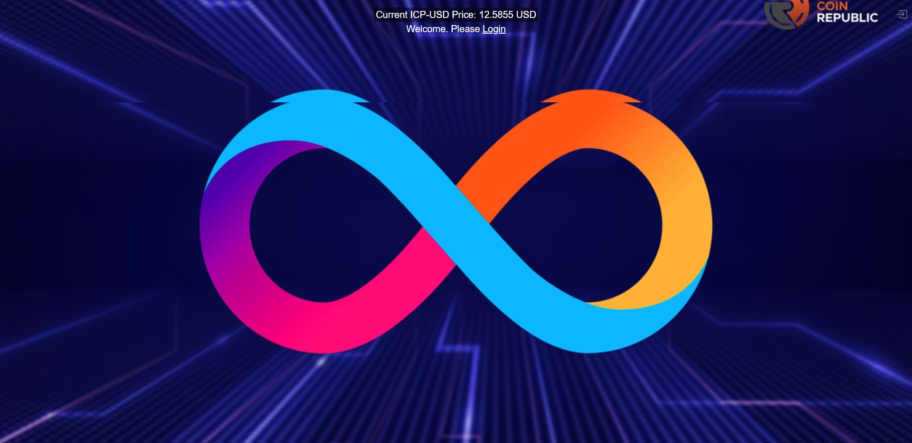
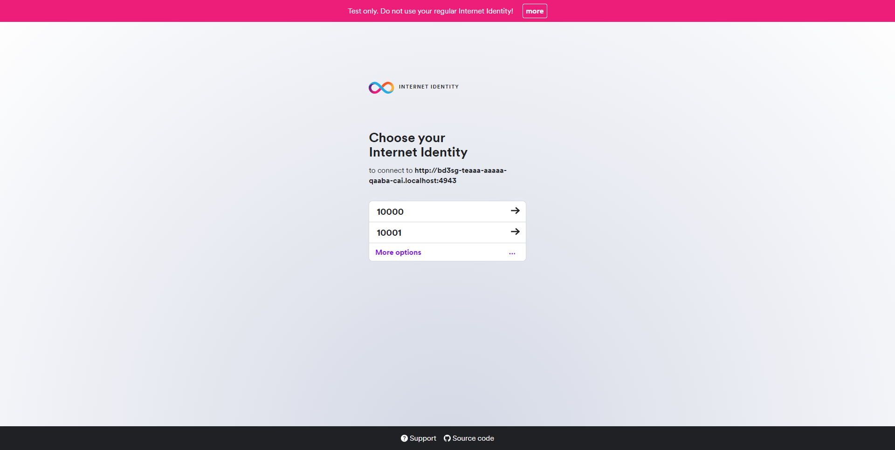
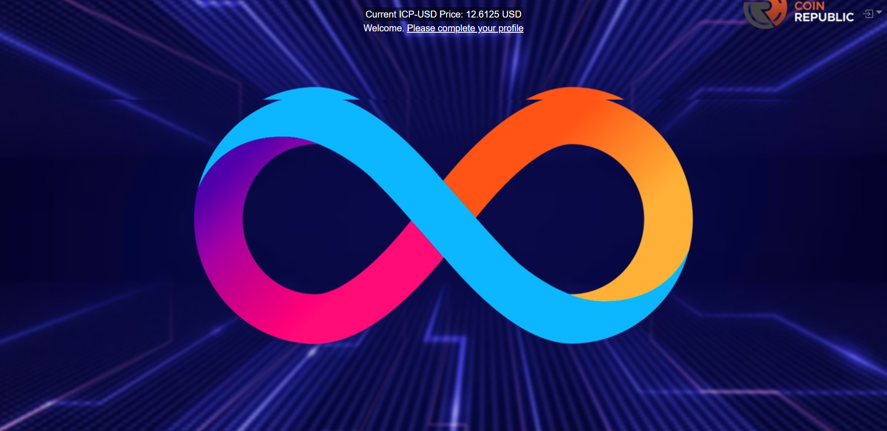
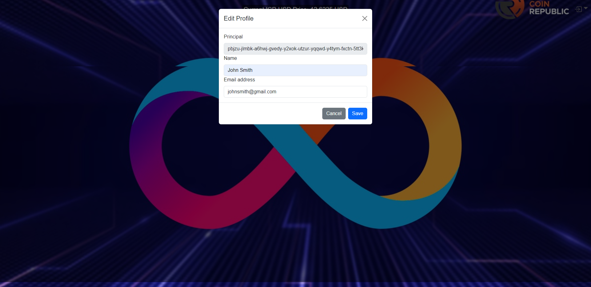

# icp_app

Welcome to icp_app project and to the Internet Computer development community.

Documentation:

- [Quick Start](https://internetcomputer.org/docs/current/developer-docs/setup/deploy-locally)
- [SDK Developer Tools](https://internetcomputer.org/docs/current/developer-docs/setup/install)
- [Motoko Programming Language Guide](https://internetcomputer.org/docs/current/motoko/main/motoko)
- [Motoko Language Quick Reference](https://internetcomputer.org/docs/current/motoko/main/language-manual)

## Features
- Login (and Logout) with Internet Identity
- Using HTTPS outcalls to fetch ICP-USD price from Coinbase API with a background job, running at max once if there is at least 1 user active on the website, weather logged-in or not
- Storing logged-in users information in stable Trie structure
- Profile popup to save optional name and email in the stable Trie structure
- Session state managment with React. Using local storage to maintain logged-in user principal (as well as profile information) and using it to restore in components if page is refreshed


Individual Screenshots:







## Running the project locally

If you want to test your project locally, you can use the following commands:

```bash
# Update Debain, install libunwind8 and NodeJS
sudo apt-get update
sudo apt-get upgrade
sudo apt-get install libunwind8
sudo apt install nodejs npm

# Install MOPS, CURL and DFX
sudo npm i -g ic-mops
sudo apt install curl
sh -ci "$(curl -fsSL https://smartcontracts.org/install.sh)"
dfx --version

# Start DFX in the background
dfx start --clean --background

# Lets setup DFX for the first time in another terminal. Create a new Identity or import an existing identity from an exported private key file

dfx identity new icp_app

# Or
dfx identity import --storage-mode plaintext icp_app icp_app.pem

# Switch to new identity
dfx identity use icp_app

# Create canisters, within icp_app/
dfx canister create --all

# Deploy all Canisters, within icp_app/
dfx deploy

# Open front canister code (icp_app\src\icp_app_frontend) in VScode (Use WSL in Windows ) and run following command to quickly test your frontend canister code without updating the deployed canister
npm start

# Open http://localhost:3000/ to view your front end application, which will be talking to backend canister, deployed on DFX locally

# Helpful commands

# Run the following command if backed code is changed and requires a canister re-create
dfx canister stop icp_app_backend &&  dfx deploy icp_app_backend && dfx canister start icp_app_backend
```

### Note on frontend environment variables

If you are hosting frontend code somewhere without using DFX, you may need to make one of the following adjustments to ensure your project does not fetch the root key in production:

- set`DFX_NETWORK` to `ic` if you are using Webpack
- use your own preferred method to replace `process.env.DFX_NETWORK` in the autogenerated declarations
  - Setting `canisters -> {asset_canister_id} -> declarations -> env_override to a string` in `dfx.json` will replace `process.env.DFX_NETWORK` with the string in the autogenerated declarations
- Write your own `createActor` constructor
